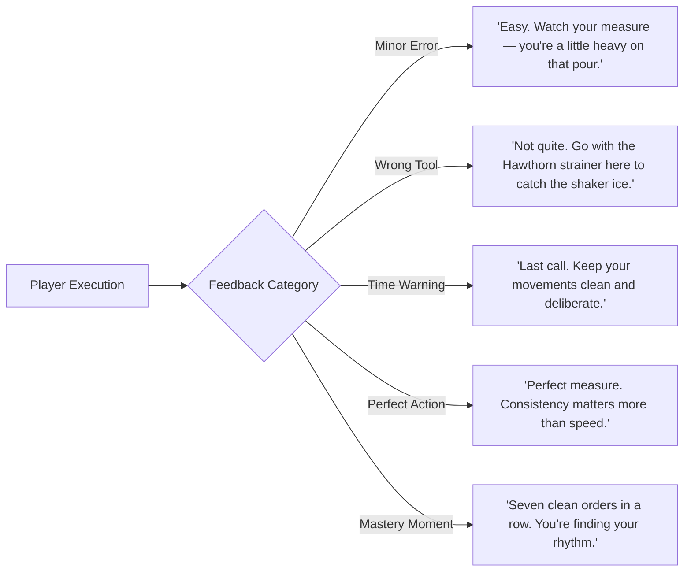

# BARBACK — Visual Design System & Design Tokens

> **"Vintage Cocktail Culture × Art Deco Jazz Lounge × Graphic Novel Illustration × Modern Game Interface."**  
> *Phase 5 Artifact: Color Tokens, Modular Typography Scales, Art Deco Component Specs, and Mentor Microcopy*

---

## 1. Color Palette Tokens & Hex Codes

### 1.1 CSS Custom Properties (`tokens.css`)

```css
:root {
  /* Environment & Atmospheric Base */
  --color-bg-navy: #0B101D;        /* Primary background & deep environment */
  --color-bg-burgundy: #2A0813;    /* Secondary panels, shadow accents */
  --color-bg-emerald: #062319;     /* Deep environmental secondary */

  /* Surface & Panel Tokens */
  --color-surface-card: #121829;   /* Art Deco card background (opaque dark navy) */
  --color-surface-overlay: #1F101A;/* Modal overlay surface (deep wine) */
  --color-border-artdeco: #E6B366; /* Thin hairline border token */

  /* Functional Accent Tokens */
  --color-action-gold: #E6B366;    /* Primary CTA, mastery highlights, selected state */
  --color-accent-magenta: #E62B79; /* Timer alerts, streak multipliers, customer impatience */
  --color-accent-cobalt: #1F40E6;  /* Secondary buttons, links, info states */
  --color-accent-emerald: #10B981; /* Success confirmation, clean pour status */

  /* Typography Colors */
  --color-text-cream: #F5EBE6;     /* Primary text on dark backgrounds */
  --color-text-gold: #E6B366;      /* Headlines, titles, badge text */
  --color-text-muted: #94A3B8;     /* Secondary metrics, timestamps, micro-labels */
  --color-text-dark: #0B101D;      /* Dark text on Champagne Gold buttons */
}
```

### 1.2 Functional Hierarchy Matrix

| Token Name | Hex Code | Visual Role | Permitted UI Elements |
| :--- | :--- | :--- | :--- |
| `color-action-gold` | `#E6B366` | **Primary Action** | "ENTER THE BAR", "TRY IN PRACTICE", "SERVE DRINK" CTA buttons; 5★ ratings; mastery badges. |
| `color-accent-magenta` | `#E62B79` | **Urgency & Energy** | Patience gauge warnings, streak multipliers (`🔥 ×7`), "LAST CALL" notifications. |
| `color-accent-cobalt` | `#1F40E6` | **Secondary Interaction** | Information popovers, secondary filter buttons, back-bar category toggles. |
| `color-text-cream` | `#F5EBE6` | **Readability & Editorial** | Body text, recipe ingredient list, step instructions, mentor dialog bubbles. |
| `color-bg-navy` / `burgundy` | `#0B101D` / `#2A0813` | **Atmosphere** | Full-bleed background canvas, card backing, dark chiaroscuro environment shading. |

---

## 2. Editorial Typography System

### 2.1 Font Pairings
- **Display & Editorial Serif**: `Playfair Display`, serif  
  *(Used for: Cocktail Titles, Hero Headings, Chapter Titles, Featured Collections, Menu Sections)*
- **Functional & Utility Sans**: `Inter`, system-ui, sans-serif  
  *(Used for: Measurements, Timers, Button Labels, Filter Tags, Mentor Dialogs, Telemetry Data)*
- **Environmental Script**: *(In-world graphics only: Vintage Bottle Labels, Chalkboard Specials, Neon Signage)*

### 2.2 Modular Type Scale

| Scale Role | Font Family | Size | Weight | Line Height | Letter Spacing | Usage |
| :--- | :--- | :--- | :--- | :--- | :--- | :--- |
| **Display Hero** | `Playfair Display` | 42px / 2.625rem | 700 (Bold) | 1.15 | -0.02em | Hero Cocktail Name (*NEGRONI*), Jazz Lounge Title |
| **Heading 1** | `Playfair Display` | 32px / 2.0rem | 600 (SemiBold)| 1.2 | -0.01em | Library Section Headers, Screen Title |
| **Heading 2** | `Playfair Display` | 24px / 1.5rem | 600 (SemiBold)| 1.25 | 0.0em | Recipe Subheaders, Customer Name |
| **Subtitle / Tag** | `Inter` | 14px / 0.875rem | 600 (SemiBold)| 1.4 | 0.08em (UPPER) | Cocktail Category Tags (*CLASSIC · SPIRIT-FORWARD*) |
| **Body Primary** | `Inter` | 16px / 1.0rem | 400 (Regular) | 1.5 | 0.0em | Ingredient Lists, Recipe Descriptions |
| **Mentor Dialog** | `Inter` | 15px / 0.9375rem| 500 (Medium) | 1.45 | 0.01em | Bartender Microcopy & Live Feedback |
| **Button Label** | `Inter` | 15px / 0.9375rem| 700 (Bold) | 1.0 | 0.06em (UPPER) | Primary & Secondary CTAs |
| **Telemetry / Metric**| `Inter` | 13px / 0.8125rem| 600 (SemiBold)| 1.2 | 0.04em | Jigger Volume (30ml), Timer Countdown |

---

## 3. Visual Component Styling (Art Deco Direction)

```
+-------------------------------------------------------------+
|  ART DECO CARD PATTERN                                      |
|  - Surface: #121829 (Opaque Midnight Navy)                  |
|  - Border: 1px solid #E6B366 (Champagne Hairline)           |
|  - Corner Radius: 6px                                       |
|  - Shadow: 0 8px 24px rgba(0, 0, 0, 0.6)                    |
+-------------------------------------------------------------+
```

### 3.1 Button Component Specifications

```css
/* Primary Gold Action Button */
.btn-primary-gold {
  background-color: #E6B366;
  color: #0B101D;
  font-family: 'Inter', sans-serif;
  font-weight: 700;
  font-size: 0.9375rem;
  letter-spacing: 0.06em;
  text-transform: uppercase;
  padding: 14px 28px;
  border-radius: 4px;
  border: 1px solid #F5EBE6;
  box-shadow: 0 4px 14px rgba(230, 179, 102, 0.25);
  transition: all 0.2s ease-in-out;
}

.btn-primary-gold:hover {
  background-color: #F5EBE6;
  color: #0B101D;
  box-shadow: 0 6px 20px rgba(245, 235, 230, 0.4);
  transform: translateY(-1px);
}

/* Urgent Magenta Action Button */
.btn-urgent-magenta {
  background-color: #E62B79;
  color: #FFFFFF;
  font-family: 'Inter', sans-serif;
  font-weight: 700;
  font-size: 0.9375rem;
  letter-spacing: 0.06em;
  text-transform: uppercase;
  padding: 14px 28px;
  border-radius: 4px;
  border: none;
  box-shadow: 0 4px 14px rgba(230, 43, 121, 0.35);
}
```

### 3.2 Collectible Badges

- 🌟 **Mastery Badge**: `Champagne Gold` background with dark navy icon + Playfair title.
- 🔥 **Streak Multiplier**: `Neon Magenta` outline + glowing numeral typography.
- 🎓 **School Certificate**: `Emerald Green` accent seal + gold foil border.

---

## 4. Bartender Mentor Microcopy & Tone Dictionary

> **Core Voice Rule**: *Teach first. Encourage second. Entertain third.*  
> **Personality**: Experienced + Calm + Knowledgeable + Encouraging + Slightly Witty.



### 4.1 Microcopy Dictionary

| Context Event | Game Status | Bartender Mentor Microcopy |
| :--- | :--- | :--- |
| **Over-Pouring** | Minor Measurement Error | *"Easy. Watch your measure — you're a little heavy on that pour."* |
| **Wrong Ingredient** | Recipe Deviation | *"Not that one. Check the recipe — we're looking for sweet vermouth."* |
| **Wrong Tool Selected** | Tool Mismatch | *"Go with the Hawthorne strainer here. It'll hold back the ice while you pour."* |
| **Time Warning** | High Impatience | *"Last call. Keep your movements clean and deliberate."* |
| **Technique Mastery** | Successful Stir/Shake | *"Give it a proper stir. We're chilling the drink without introducing unnecessary dilution."* |
| **Perfect Service** | 100% Accuracy | *"Good work. That's a clean serve."* |
| **Retention Achievement** | No Hint Used | *"You remembered the recipe without the hint. That's progress."* |
| **Speed Streak** | Consecutive Pours | *"Seven clean orders in a row. You're finding your rhythm."* |

---
*Document Version: 1.0.0 — Generated for Phase 5: Visual Design System & Tokens*
