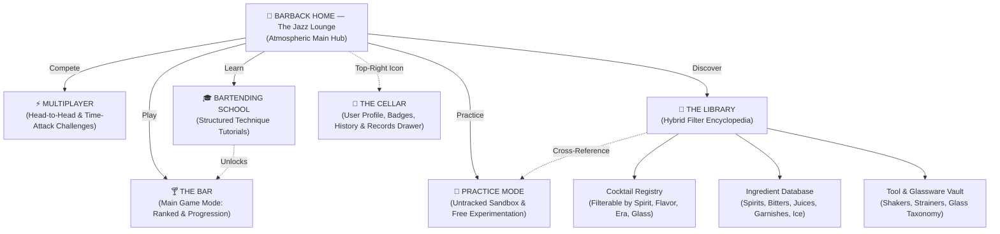
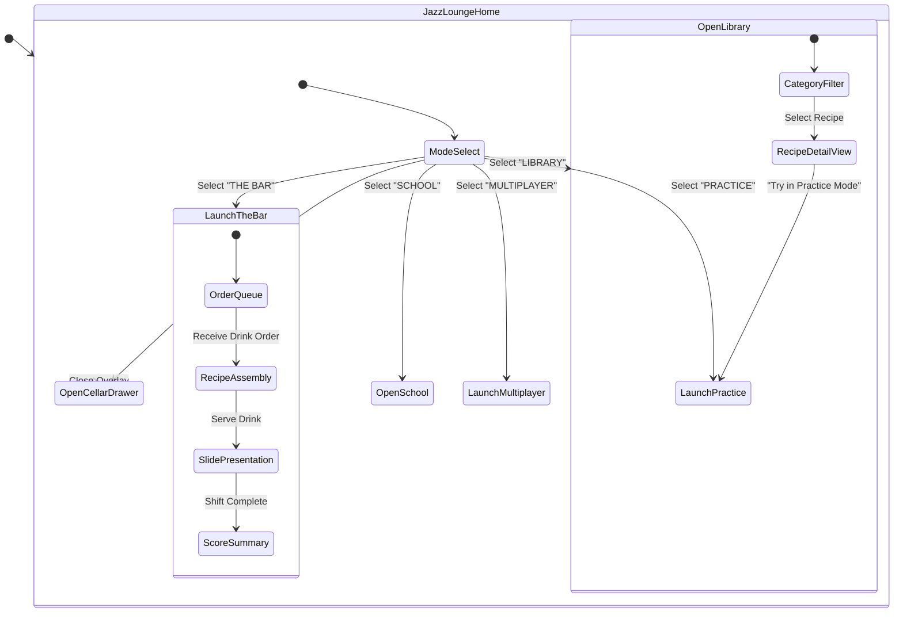

# BARBACK — Information Architecture & Taxonomy Specification

> **"Three ways to play. One virtual bar."**  
> *Phase 3 Artifact: Navigation Architecture, Relational Schemas, and Information Taxonomies*

---

## 1. Primary Navigation Sitemap (Fruit Ninja Jazz Lounge Paradigm)



---

## 2. The Library: Hybrid Taxonomy Architecture

The Library is governed by a relational hybrid filter system that bridges cocktails, spirits, tools, and preparation styles without rigid hierarchical walls.

```
                    +------------------------------------+
                    |       THE LIBRARY SYSTEM           |
                    +------------------------------------+
                                      |
         +----------------------------+----------------------------+
         |                                                         |
         v                                                         v
 [ COCKTAIL TAXONOMY ]                                    [ INGREDIENT & TOOL VAULT ]
 - Base Spirit (Vodka, Gin, Rum, Tequila...)             - Base Spirits & Modifiers
 - Flavor Profile (Citrus, Spirit-Forward, Herbal...)    - Juices, Syrups & Bitters
 - Technique (Shaken, Stirred, Built, Muddled)          - Garnishes & Ice Types
 - Era & Culture (Pre-Prohibition, Speakeasy, Tiki...)   - Shakers, Strainers & Glassware
 - Special Collections (House Specials, Zero-Proof...)
```

### 2.1 Special Curated Collections
- 🌟 **The Classics**: Fundamental recipes every mixologist must master (e.g., *Old Fashioned, Negroni, Daiquiri, Manhattan, Margarita*).
- 🎷 **House Specials**: Signature bespoke recipes exclusive to the Barback Jazz Lounge universe.
- 🌴 **Tropical Escape**: High-flavor, fruit-forward rum and tiki-style cocktails.
- 🌙 **The Nightcap**: Spirit-forward, bittersweet, and velvet after-dinner slow-sippers.
- 🎓 **Behind the Bar**: Recipe challenges specifically curated to teach physical techniques (e.g., *Double Straining, Layering, Egg White Dry Shaking*).
- 🍃 **Zero Proof**: Sophisticated non-alcoholic craft mocktails.

---

## 3. Relational Data Schemas (JSON Architecture)

### 3.1 Cocktail Schema (`cocktail.schema.json`)
```json
{
  "$schema": "http://json-schema.org/draft-07/schema#",
  "title": "CocktailRecipe",
  "type": "object",
  "properties": {
    "id": { "type": "string", "example": "negroni" },
    "name": { "type": "string", "example": "Negroni" },
    "era": { "type": "string", "enum": ["Pre-Prohibition", "Modern Classic", "Speakeasy", "Tiki", "Contemporary", "Zero-Proof"] },
    "difficulty": { "type": "string", "enum": ["Beginner", "Intermediate", "Advanced"] },
    "glasswareId": { "type": "string", "example": "rocks_glass" },
    "iceType": { "type": "string", "enum": ["Large_Cube", "Standard_Cubes", "Crushed", "Neat"] },
    "technique": { "type": "string", "enum": ["Stirred", "Shaken", "Built", "Muddled", "Layered"] },
    "strainerRequired": { "type": "string", "enum": ["Julep", "Hawthorn", "Double_Mesh", "None"] },
    "flavorProfiles": {
      "type": "array",
      "items": { "type": "string", "example": "Bitter" }
    },
    "ingredients": {
      "type": "array",
      "items": {
        "type": "object",
        "properties": {
          "ingredientId": { "type": "string", "example": "gin_london_dry" },
          "volumeOz": { "type": "number", "example": 1.0 },
          "sequenceOrder": { "type": "integer", "example": 1 }
        }
      }
    },
    "garnishId": { "type": "string", "example": "orange_peel_twist" },
    "presentationNotes": { "type": "string", "example": "Express orange peel oils over surface and rim glass." }
  }
}
```

### 3.2 Equipment & Glassware Schema (`equipment.schema.json`)
```json
{
  "$schema": "http://json-schema.org/draft-07/schema#",
  "title": "BarEquipment",
  "type": "object",
  "properties": {
    "id": { "type": "string", "example": "hawthorn_strainer" },
    "name": { "type": "string", "example": "Hawthorn Strainer" },
    "category": { "type": "string", "enum": ["Mixing_Shaking", "Measuring_Straining", "Preparation_Garnishing", "Glassware"] },
    "primaryUse": { "type": "string", "example": "Straining shaken cocktails with ice gate spring." },
    "associatedTechniques": {
      "type": "array",
      "items": { "type": "string", "example": "Shaking" }
    }
  }
}
```

---

## 4. Navigation Flow & User State Machine



---

## 5. Equipment Matrix & Integrations

| Equipment Item | Category | Primary Gameplay Mechanics | Progressive Difficulty Trigger |
| :--- | :--- | :--- | :--- |
| **Boston Shaker** | Mixing & Shaking | 2-tin snapping interaction; 2D shake gesture. | Intermediate & Advanced |
| **Cobbler Shaker** | Mixing & Shaking | Built-in cap pour interaction. | Beginner |
| **Jigger** | Measuring & Straining | Precise liquid volume fill gauge holding. | All Tiers (Auto-stop at Beginner) |
| **Bar Spoon** | Mixing & Shaking | Circular drag-motion stirring mechanic. | Intermediate & Advanced |
| **Hawthorn Strainer** | Measuring & Straining | Fits shaker tin rim; filters ice cubes. | Intermediate |
| **Fine Mesh Strainer** | Measuring & Straining | Double-strain secondary overlay hold. | Advanced (Citrus/Herb Pulp Removal) |
| **Muddler** | Prep & Garnish | Press-and-twist press mechanic on mint/lime. | Intermediate & Advanced |
| **Glassware Suite** | Glassware | Drag-to-coaster selection; rim salt/sugar. | All Tiers |

---
*Document Version: 1.0.0 — Generated for Phase 3: Information Architecture & Taxonomy*
