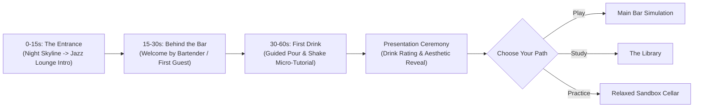
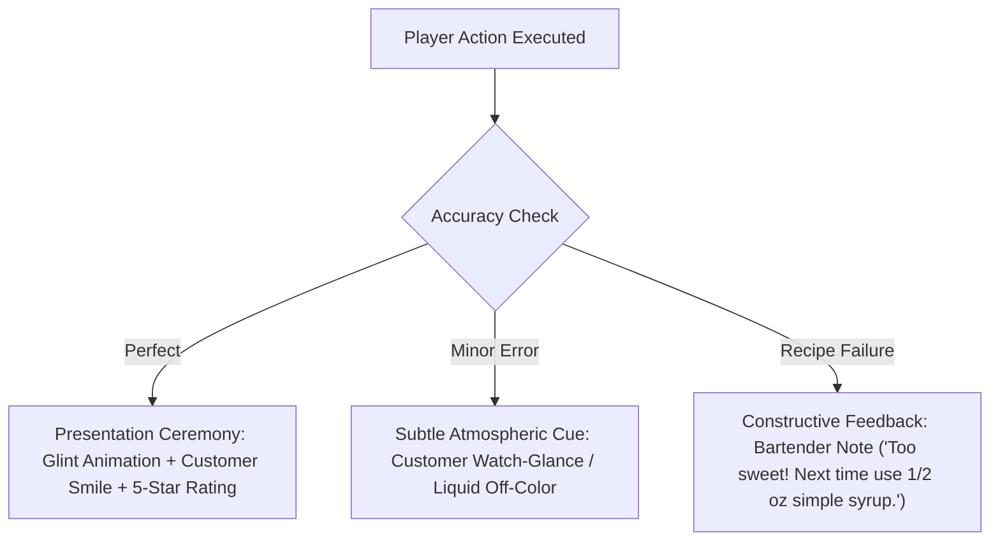

# BARBACK — UX Research & User Experience Modeling

> **"A game that rewards curiosity before perfection."**  
> *Phase 2 Artifact: Empathy Maps, Journey Frameworks, and Progressive Interaction Systems*

---

## 1. Persona Spectrum & Empathy Maps

```
                      +----------------------------------+
                      |       THE BARBACK SPECTRUM       |
                      +----------------------------------+
                                       |
       +-------------------------------+-------------------------------+
       |                               |                               |
       v                               v                               v
[ 1. CURIOUS GEN-Z ]        [ 2. ASPIRING MIXOLOGIST ]       [ 3. CASUAL GAMER ]
"Wants atmospheric discovery"  "Wants authentic technique"     "Wants flow state & mastery"
```

### 1.1 Persona 1: Maya — The Atmospheric Explorer (Curious Gen-Z)
* **Says**: "I love the vibe of speakeasies, but cocktail menus feel like a foreign language."
* **Thinks**: "I want to know what to order or make at home without feeling uneducated."
* **Does**: Explores visual apps, saves aesthetics on Pinterest, seeks low-pressure interactive experiences.
* **Feels**: Intimidated by traditional recipe books; drawn to immersive, moody visual design.

### 1.2 Persona 2: Liam — The Craft Learner (Aspiring Bartender)
* **Says**: "I want to memorize recipes, glass pairings, and pouring ratios before my first bar shift."
* **Thinks**: "Standard cooking games are jokes—they don't teach real-world technique."
* **Does**: Reads mixology guides, practices pours, seeks precise feedback.
* **Feels**: Eager to master genuine skills; frustrated by dumbed-down mobile games.

### 1.3 Persona 3: Sam — The Flow-State Arcade Gamer (Casual Gamer)
* **Says**: "Give me a satisfying game loop with great feedback where I can zone out and hit high scores."
* **Thinks**: "I don't care about reading long articles; let me play and get better."
* **Does**: Optimizes time management, hunts achievements, competes on leaderboards.
* **Feels**: Rewarded by tactile muscle memory, combo streaks, and visual presentation ceremonies.

---

## 2. Onboarding User Journey Map (The First 60 Seconds)



### Journey Stages Breakdown

| Timeline | Phase Name | Visual & Audio Signals | Interaction & Action | Emotional State |
| :--- | :--- | :--- | :--- | :--- |
| **0 – 15s** | **The Entrance** | Neon skyline transition into warm amber jazz lounge; ambient upright bass music. | Passive visual entry; title splash screen smoothly dissolves. | Intriguing, evocative, atmospheric. |
| **15 – 30s** | **Behind the Bar** | First-person bar counter view; welcoming regular customer or head bartender avatar. | Dialogue prompt: *"Welcome behind the counter. Let's pour your first drink."* | Welcoming, low pressure. |
| **30 – 60s** | **The First Drink** | Highlighted back-bar bottle, jigger fill indicator, shaker shake-gesture prompt. | **Guided Micro-Pour**: Pick glass $\rightarrow$ Jigger measure $\rightarrow$ Shake gesture $\rightarrow$ Serve. | Tactile satisfaction, instant competence. |
| **Post-60s** | **The Forking Path** | Unlocked Hub displaying *The Bar*, *The Library*, *The Cellar*. | User chooses their preferred engagement depth without forced rails. | Empowered, curious, autonomous. |

---

## 3. Progressive Mechanics & Granularity Matrix

Barback dynamically scales physical technique requirements based on player mastery tiers:

```
BEGINNER (Guided Comfort)  --->  INTERMEDIATE (Tactile Choice)  --->  ADVANCED (Master Artisanship)
```

| Game System | Beginner Tier | Intermediate Tier | Advanced Tier |
| :--- | :--- | :--- | :--- |
| **Glassware** | Auto-recommended & highlighted. | Selected from category (Coupe, Highball, Rocks). | Exact choice (Nick & Nora vs. Coupe, Chilled vs. Room Temp). |
| **Ice Selection** | Standard Ice automatically applied. | Choice between Cubed vs. Crushed. | Precise Selection (Large Rock, Crushed, Block, No Ice/Neat). |
| **Pouring Mechanics** | Target line marker visible; auto-stop assist. | Free-pour with visible liquid level gauge. | Blind volume jigger pour; reliance on visual fill cues. |
| **Straining & Tools** | Single action: "Strain & Serve". | Choice of Shake vs. Stir technique. | Equipment matching (Hawthorn vs. Julep vs. Double Mesh Fine Strainer). |
| **Mistake Tolerance** | High; visual hints & correction undo. | Moderate; score reduction on incorrect ratio. | Strict; customer reaction & drink rejection if ruined. |

---

## 4. Visual Feedback & Constructive Error System

Mistakes serve as educational feedback loops rather than punitive failures.



### Error Feedback Taxonomy

| Error Type | Visual / Environmental Cue | Gameplay Impact | Educational Resolution |
| :--- | :--- | :--- | :--- |
| **Over-Pouring** | Liquid line rises past jigger rim; slight glass spill graphic. | Precision score reduced (-10%). | Highlights target fluid dram/ounce measurement. |
| **Wrong Glass** | Glass sits awkwardly on coaster; subtle yellow outline. | Presentation score reduced (-15%). | Popover note explaining thermal insulation & aromatics of correct glass. |
| **Wrong Strainer/Ice** | Dilution marker flickers; customer pauses before sip. | Technique score reduced (-10%). | Library cross-reference unlocked for ice surface area science. |
| **Slow Service** | Customer taps fingers rhythmically to jazz track; order bubble pulses. | Time bonus decays gradually. | Prompts back-bar bottle organization tips. |

---

## 5. The Mastery Ceremony Model

Mastery in Barback is celebrated through a multi-faceted **Presentation Ceremony**:

1. **The Slide & Reveal**: Completed cocktail slides forward onto a polished mahogany coasters under a warm spotlight.
2. **Visual Aesthetics Evaluation**:
   - **Clarity & Color**: Reflects correct spirits and ice dilution.
   - **Garnish Placement**: Precision alignment of citrus twist, olive, or mint sprig.
3. **Mastery Badges Unlocked**:
   - 🌟 *Perfect Pour*: 100% volumetric accuracy.
   - ⏱️ *Speed Streak*: Fast execution under high-order volume.
   - 🧠 *Retention Master*: Recipe assembled entirely without recipe book reference.

---
*Document Version: 1.0.0 — Generated for Phase 2: Empathy & User Experience Modeling*
