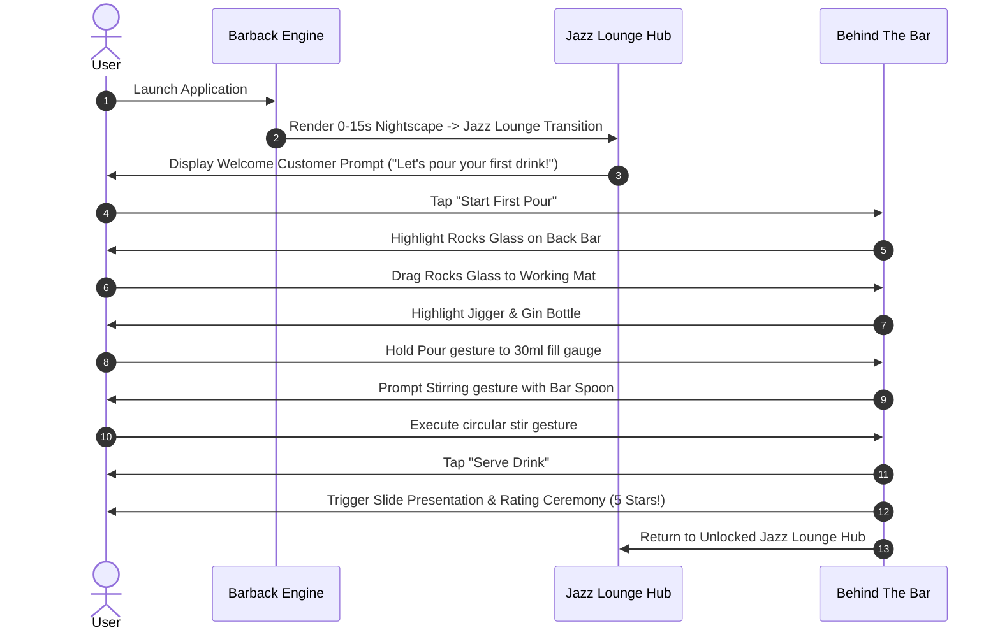
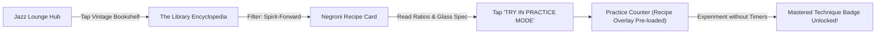

# BARBACK — Low-Fidelity Wireframes & User Flows Specification

> **"Explore the world → Choose an experience → Master the craft."**  
> *Phase 4 Artifact: Screen-by-Screen Layout Schematics, Spatial Hotspots, and Action Task Flows*

---

## 1. Screen Layout A: The Jazz Lounge (Home Screen Hub)

```text
┌────────────────────────────────────────────────────────────────────────────────────────┐
│ [≡] BARBACK                                            [👤] CELLAR  [⚙️] SETTINGS       │
│                                                                                        │
│                                                                                        │
│                       BACKGROUND: GRAPHIC NOIR JAZZ LOUNGE                             │
│                  (Dramatic chiaroscuro, warm lamps, city skyline view)                 │
│                                                                                        │
│                                                                                        │
│             +-----------------------+              +-----------------------+           │
│             |  HOTSPOT 4: LIBRARY   |              | HOTSPOT 3: MULTIPLAYER|           │
│             |  [Vintage Bookshelf / |              | [Social Lounge Seating|           │
│             |    Recipe Cabinet]    |              |   w/ Characters]      |           │
│             +-----------------------+              +-----------------------+           │
│                         \                                      /                       │
│                          \                                    /                        │
│                           v                                  v                         │
│             +-----------------------+              +-----------------------+           │
│             |  HOTSPOT 1: THE BAR   |              |  HOTSPOT 2: PRACTICE  |           │
│             |  [Main Bar Counter &  |              |  [Quiet Table w/      |           │
│             |     Illuminated Bar]  |              |    Craft Cocktail]    |           │
│             +-----------------------+              +-----------------------+           │
│                                                                                        │
│                                                                                        │
│ [🎓] BARTENDING SCHOOL                                                      [❓] HELP   │
└────────────────────────────────────────────────────────────────────────────────────────┘
```

### Spatial Hierarchy & Interactivity
- **Primary Hotspots (Main 4 Destinations)**:
  1. **The Bar Counter** $\rightarrow$ Triggers `THE BAR` (Main Game Mode).
  2. **Corner Table with Drink** $\rightarrow$ Triggers `PRACTICE MODE` (Untracked Sandbox).
  3. **Social Lounge Table** $\rightarrow$ Triggers `MULTIPLAYER` (Head-to-Head Challenges).
  4. **Vintage Bookshelf/Cabinet** $\rightarrow$ Triggers `THE LIBRARY` (Encyclopedia).
- **Secondary Edge Utilities**:
  - Top Left: `[≡] BARBACK` Brand Identity.
  - Top Right: `[👤] THE CELLAR` Drawer & `[⚙️] SETTINGS` Modal.
  - Bottom Corners: `[🎓] BARTENDING SCHOOL` & `[❓] HELP / TUTORIAL`.

---

## 2. Screen Layout B: Behind The Bar Counter (Main Gameplay Layout)

```text
┌────────────────────────────────────────────────────────────────────────────────────────┐
│ [←] BACK TO LOUNGE                           PAUSE [⏸️]   SCORE: 1,450  STREAK: 🔥 ×3  │
├────────────────────────────────────────────────────────────────────────────────────────┤
│                                                                                        │
│   CUSTOMER AVATAR                              ORDER SPECIFICATION CARD                │
│   ┌──────────────────┐                         ┌────────────────────────────────────┐  │
│   │                  │                         │  1 × NEGRONI                       │  │
│   │   [Character]    │  PATIENCE GAUGE         │  • 30ml Gin                        │  │
│   │  (Reaction State)│  [████████████░░]       │  • 30ml Campari                    │  │
│   │                  │                         │  • 30ml Sweet Vermouth             │  │
│   └──────────────────┘                         └────────────────────────────────────┘  │
│                                                                                        │
├────────────────────────────────────────────────────────────────────────────────────────┤
│                                                                                        │
│                                    WORKING MAT                                         │
│                  (Active Interaction Surface - Dynamic Tool Slots)                     │
│                                                                                        │
│        GLASSWARE SLOT             MEASUREMENT / MIXING              TOOL / GARNISH SLOT│
│       ┌──────────────┐           ┌────────────────────┐            ┌──────────────────┐│
│       │  [Rocks      │           │   [Jigger Fill     │            │  [Orange Twist   ││
│       │   Glass]     │           │    Gauge: 30ml]    │            │   / Ice Cubes]   ││
│       └──────────────┘           └────────────────────┘            └──────────────────┘│
│                                                                                        │
│                                [ SERVE DRINK BUTTON ]                                  │
│                                                                                        │
├────────────────────────────────────────────────────────────────────────────────────────┤
│                                                                                        │
│                         PERMANENT COMPACT BACK-BAR SHELF                               │
│  ┌────────────┬─────────────┬──────────────┬─────────────┬──────────────┬────────────┐ │
│  │ SPIRITS    │ MIXERS      │ GARNISHES    │ ICE TYPES   │ TOOLS        │ GLASSWARE  │ │
│  │ [Gin]      │ [Campari]   │ [Orange Twist│ [Large Cube]│ [Jigger]     │ [Rocks]    │ │
│  │ [Whiskey]  │ [Vermouth]  │ [Olive]      │ [Crushed]   │ [Bar Spoon]  │ [Coupe]    │ │
│  │ [Vodka]    │ [Juice]     │ [Lime Wedge] │ [Cubes]     │ [Shaker]     │ [Highball] │ │
│  └────────────┴─────────────┴──────────────┴─────────────┴──────────────┴────────────┘ │
└────────────────────────────────────────────────────────────────────────────────────────┘
```

### Gameplay Interaction Zones
- **Top Zone (Customer & Order Telemetry)**: Real-time customer reaction states (*Waiting $\rightarrow$ Watching $\rightarrow$ Impatient $\rightarrow$ Happy*) + Order requirements & patience gauge.
- **Center Zone (Working Mat)**: Dynamic slots for current active task (*Glass placement, Jigger pour measurement gauge, Stirring gesture ring, Garnishing*).
- **Bottom Zone (Permanent Back Bar)**: Fixed-position categorized back-bar shelf (*Spirits, Mixers, Garnishes, Ice, Tools, Glassware*) for drag-and-drop or tap-to-place interactions.

---

## 3. Screen Layout C: Editorial Cocktail Recipe Card (The Library)

```text
┌────────────────────────────────────────────────────────────────────────────────────────┐
│ [←] BACK TO LIBRARY                                                      BOOKMARK [🔖] │
├────────────────────────────────────────────────────────────────────────────────────────┤
│                                                                                        │
│                         [ LARGE ARTISTIC COCKTAIL ILLUSTRATION ]                       │
│                         (High-contrast graphic novel styling, glass reflections)       │
│                                                                                        │
├────────────────────────────────────────────────────────────────────────────────────────┤
│                                                                                        │
│   NEGRONI                                                                              │
│   CLASSIC · SPIRIT-FORWARD · BITTER                                                    │
│                                                                                        │
│   A bitter, aromatic Italian classic born in Florence. A harmonious 1:1:1 balance      │
│   of London Dry Gin, Campari, and Sweet Red Vermouth.                                  │
│                                                                                        │
│   ───────────────────────────────────────────────────────────────────────────────────  │
│                                                                                        │
│   INGREDIENTS                                  SPECIFICATIONS                          │
│   • 30ml London Dry Gin                        • Glassware: Rocks Glass                │
│   • 30ml Campari                               • Technique: Stirred over Ice           │
│   • 30ml Sweet Red Vermouth                    • Ice: Single Large Cube                │
│   • Garnish: Expressed Orange Peel             • Difficulty: Intermediate (●●○)        │
│                                                                                        │
│   ┌─────────────────────────────────────────────────────────────────────────────────┐  │
│   │                           TRY IN PRACTICE MODE                                  │  │
│   └─────────────────────────────────────────────────────────────────────────────────┘  │
│                                                                                        │
└────────────────────────────────────────────────────────────────────────────────────────┘
```

---

## 4. User Task Flows

### Task Flow 1: 0–60s Onboarding to First Serve


### Task Flow 2: Recipe Discovery to Practice Mode Transition


---

## 5. Screen State Matrix

| Screen ID | Primary Purpose | Key Interactive Elements | Exit/Transition Paths |
| :--- | :--- | :--- | :--- |
| **SCR-01 (Jazz Lounge)** | Main Visual Hub & Experience Selection | 4 Main Hotspots (Bar, Practice, Multiplayer, Library) + 4 Corner Utilities. | Navigates directly into SCR-02, SCR-03, SCR-04, or Cellar Drawer. |
| **SCR-02 (Behind The Bar)** | Active Bartending Simulation | Working Mat, Dynamic Jigger Fill Gauge, Permanent Back-Bar, Customer Reaction Avatar. | "Serve Drink" $\rightarrow$ Presentation Ceremony; "Pause" $\rightarrow$ Return to Lounge. |
| **SCR-03 (Library Detail)** | Recipe & Technique Learning | Editorial Recipe Card, Ingredient Ratios, Glassware Spec, "TRY IN PRACTICE MODE" CTA. | CTA $\rightarrow$ Launches SCR-02 in Untracked Practice State; Back $\rightarrow$ Library Index. |
| **SCR-04 (Cellar Drawer)** | User Progress & Badges | Career Telemetry, Mastered Cocktail Cards, High Score History, Trophy Case. | Swipe Right / Close $\rightarrow$ Return to SCR-01. |

---
*Document Version: 1.0.0 — Generated for Phase 4: User Flows & Low-Fidelity Wireframes*
